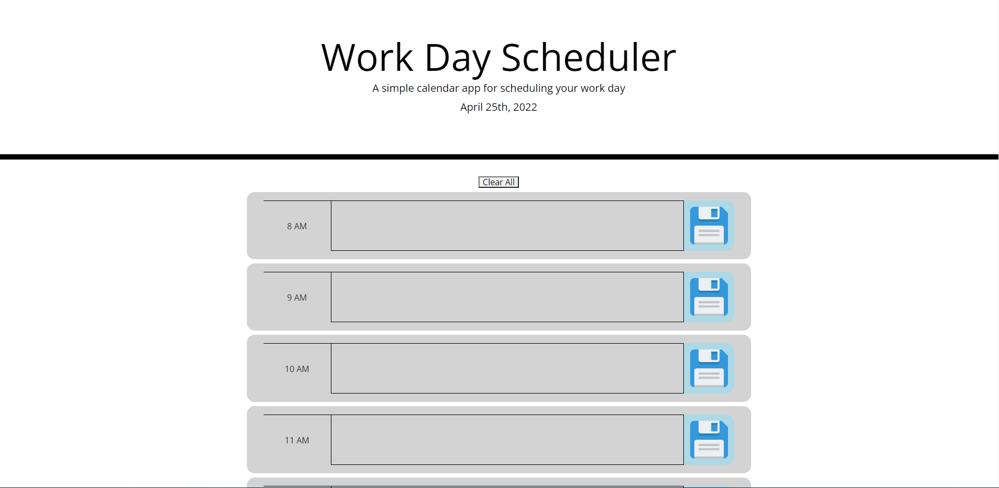

# BC-HW-5
Simple Day Planner Web App

Deployed Site:
https://tonyavall.github.io/BC-HW-5/

Stack: HTML, CSS, JavaScript (Jquery, Moment.js)

Logic Map:

1. Current Day is displayed at the top of the calendar.
    a. Use Moment.js to grab current date.
2. Section div input fields where
    a. User input is taken.
    b. User input is appended into input field.
    c. User input is saved into local storage and input fields persist.
3. Timeblocks for standard business hours 8-8? Example is 9-5.
    a. Timeblocks are color coded for past, present, and future.
    b. Moment.js to grab current time.

Approach: Timeblocks are hardcoded into HTML and manipulated via Javascript. 

Concept Abstract: Timeblocks have contenteditable p tags that the user can edit. When the user clicks on the save button the right, it will store the textContent of the p tags into the localStorage.
